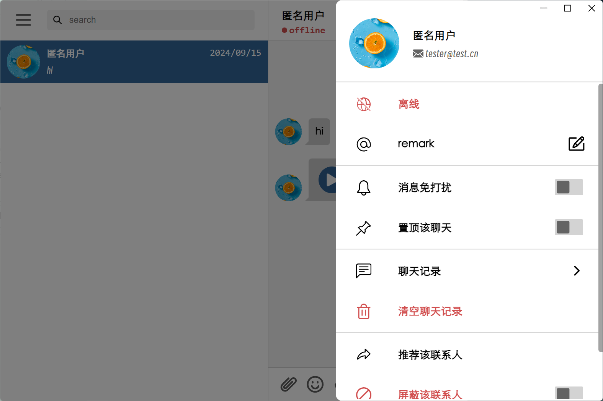

# FChat

> 这是一个基于Electron + Vue3 + Node.js + MongoDB + Mongoose + Vite的桌面端在线聊天软件，支持实时消息推送和用户认证。更多功能正在开发中..





## 功能列表

- 用户注册、登录、认证
- 添加好友
- 实时消息推送
- 表情发送
- 消息记录游标分页
- 消息记录本地缓存
- 消息已读未读识别
- 主题切换
- 语音消息发送

## 安装步骤

##### 后端

1. `cd back-end`：进入后端目录
2. `npm install`：安装依赖
3. `npm run start`：启动后端（development模式）
4. `npm run serve`：启动后端（production模式）

##### 前端

1. `cd front-end`：进入前端目录
2. `npm install`：安装依赖
3. `npm run dev`：启动前端项目（development模式）
4. `npm run build:win`：打包前端项目，生成可执行文件（production模式）

## 配置说明

- 在 `/back-end/.env.development` 和 `/back-end/.env.production` 中分别配置对应环境的服务端信息、MongoDB数据库和JWT密钥

  - 配置参考：

    ```js
    PROTOCOL=http
    IP=127.0.0.1
    PORT=8080
    DB_HOST=127.0.0.1
    DB_PORT=27017
    DB_NAME=FChat
    SECRET_KEY=123123123123
    MAIL_HOST=smtp.qq.com
    MAIL_PORT=465
    MAIL_USER=test@qq.com
    MAIL_PASS=123123123123
    ```
- 在 `/front-end/.env.development` 和 `/front-end/.env.production` 中配置客户端信息

  - 配置参考

    ```js
    VITE_PROTOCOL = 'ws'
    VITE_PORT = '8080'
    VITE_IP = '127.0.0.1'
    ```

## 许可

MIT License

## 联系方式

- Email：chengfayang@henu.edu.cn
