# 2024/6

## day 27

- 新建项目
- 搭建了界面基本结构（Layout 组件）
- main 中配置了标题栏样式
- renderer 中设置了标题栏的可拖拽部分

# 2024/7

## day 3

- 实现了主题切换（基于 CSS 变量）
  - 在全局样式文件中添加两个类（`dark-theme`和 `light-theme`），当中存放同名不同值的 css 变量
  - 在 body 标签上添加 `light-theme`类作为默认样式
  - 切换时，只需要通过 `document.body.classList.toggle('dark-theme')`便可以切换样式（body 同时有 dark 和 light 两个类时，后添加的 dark 类中重复的样式会覆盖 light 中的）

## day 8

- 实现动态修改标题栏样式

  - 添加 `changeTitleBar`事件，在切换主题时触发，修改标题栏的颜色

- 添加 `vue-router`
- 添加了登录窗口，实现了窗口间切换

  - 添加 `openNewWindow`事件，在登录成功后触发，打开主界面并关闭登录窗口
  - 添加 `createWindow`方法的参数，可动态设置窗口的属性
  - 通过参数中的 `route`属性可以设置窗口打开时的路由

- 添加自定表单组件 `FBtn`。

  - 引入时报错 `[Vue warn]: Property "Login" was accessed during render but is not defined on instance.`报错行为 `Login`页面中使用 `FBtn`组件的那行。报错原因是 `FBtn`的 `label`属性误加了冒号

## day 9

- 编写登录窗口样式

  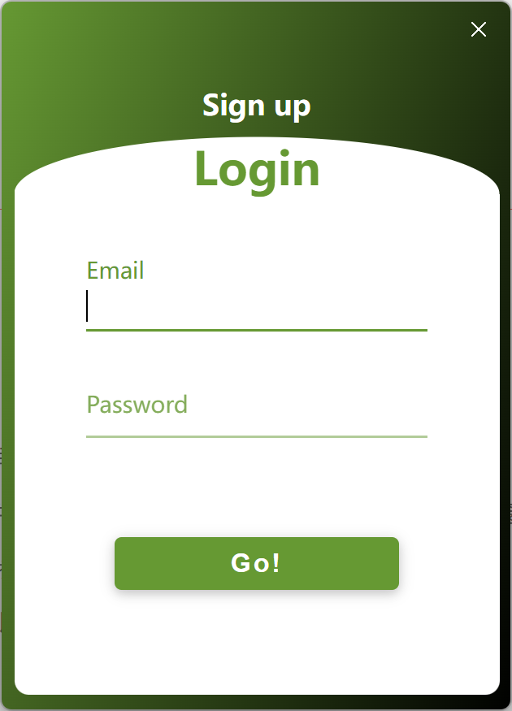

- 引入自定输入框组件

  - 通过 `v-model`实现了数据的双向绑定，动态传入输入框的 `label`、双向绑定 `value`、`type`属性

- 实现登录与注册窗口的动态切换

  

- 添加注册用邮箱验证码检测窗口

  - 在主进程中添加新函数 `createModalWin`函数用于创建模态窗口，需要指定父窗口，模态窗口显示时不能操作父窗口

  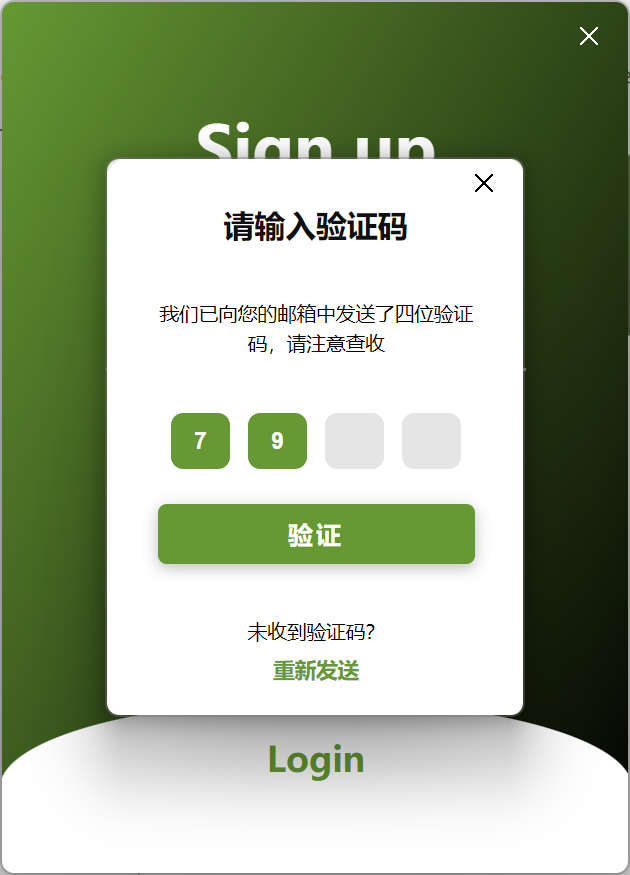

## day 10

- 完善注册界面

  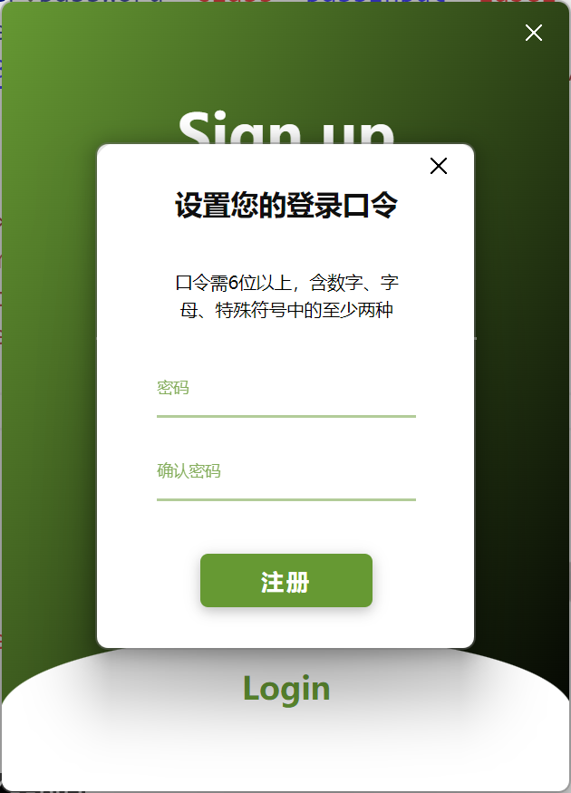

## day 19

- 使用 pixso 工具对主界面进行初步设计

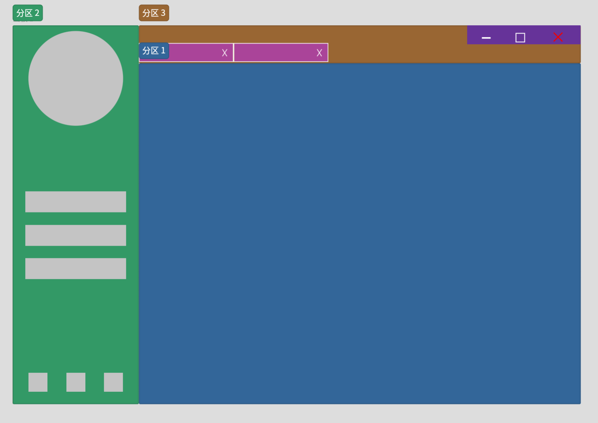

## day 20

- 之前的界面感觉不太合理。重新设计了主界面结构

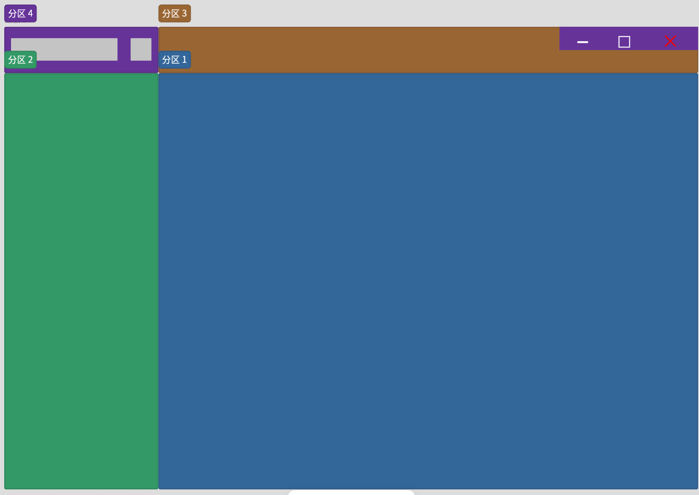

## day 21

- 实现了拖拽边框动态设置边栏宽度的功能

## day 22

- 编写左边栏的样式
- 使用 apifox 工具中的 Mock 接口来模拟获取后端数据
- 引入了 axios 用于发送请求。进行了简单封装
- 在 vite 配置文件中通过代理服务器的方式解决了跨域问题
- 新建了 SearchInput 组件和 Icon 组件。Icon 组件将存放所有的图标，通过传入 name 属性来显示对应的图标

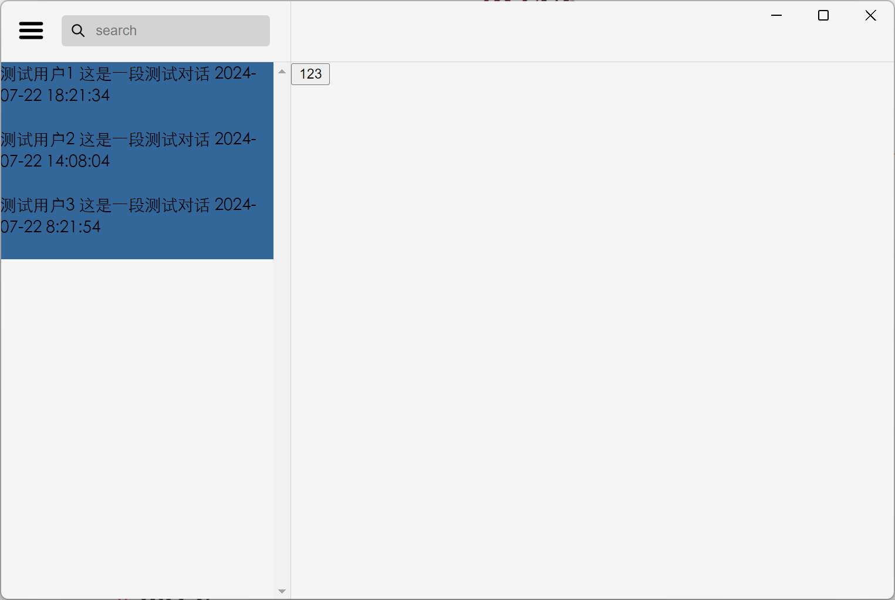

## day 23

- 继续完善左边栏样式
- 新增了 Avatar 组件用来显示头像，传入 url、size、shape 三个属性来自定图片内容、大小和形状（圆形和方形）
- 编写了完善的日期处理工具

  - 可以将传入时间转换成如下显示格式：

    1. 当天的时间显示格式：`时:分 时段`，采用 12 小时制，且时数不需额外补零
    2. 昨天的时间显示：`昨天`
    3. 本周内的时间显示：`周n`
    4. 更早的时间显示：`年/月/日`

- 实现了列表中名称和消息处的单行文本显示，超出文本显示为省略号

  ```css
  text-overflow: ellipsis;
  overflow: hidden;
  white-space: nowrap;
  ```

- 完善了左边栏拖动限制和窗口 min-width、min-height 的限制
- 拖动边框放大窗口时边框处会有黑条出现。不过同样用 electron 编写的 vscode 也存在这种情况我就放心了

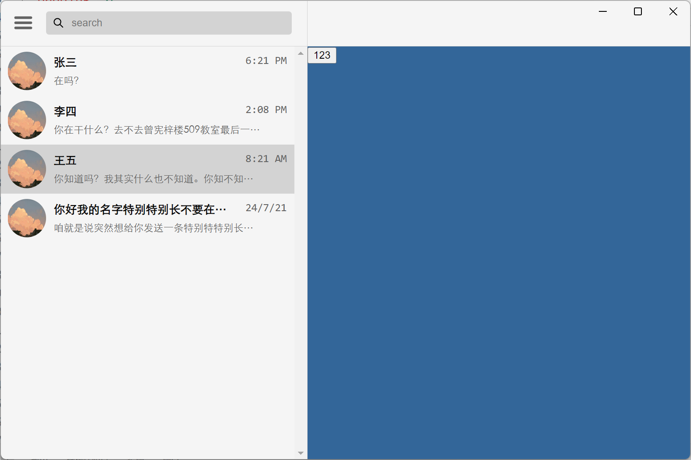

## day 24

- 修改了左边栏滚动条的样式
  - 实现了悬浮时显示滚动条，移出时隐藏滚动条
  - 滚动条出现时不会挤压左侧内容产生偏移
  - 滚动条不在顶端时添加边界线
- 新增了右侧页面结构对应的路由
- 实现了点击左侧聊天列表跳转至对应的路由
  - 通过代理事件进行了优化，只需绑定一个点击事件

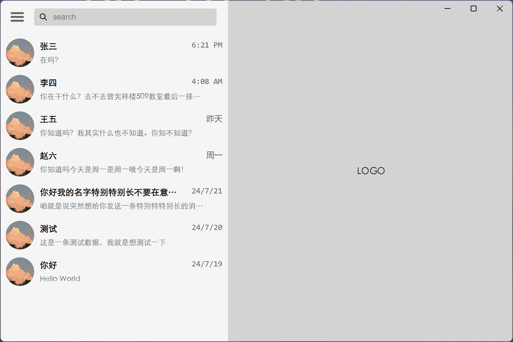

## day 25

- 完善右侧聊天框样式
- 优化 Icon 组件显示逻辑
  - 通过 Map 记录图标，key 为图标 name，value 为 svg 字符串，通过 v-html 传入 svg 字符串的方式渲染 props 中的 name 属性指定的图标
- 实现自定义窗口栏按钮，通过在 main 中监听窗口最大化和恢复事件来通知 renderer，以更换第二个图标
- 完善左侧聊天列表的 active 显示
  - 初始化时或点击聊天项时，获取 active 的项并添加对应样式

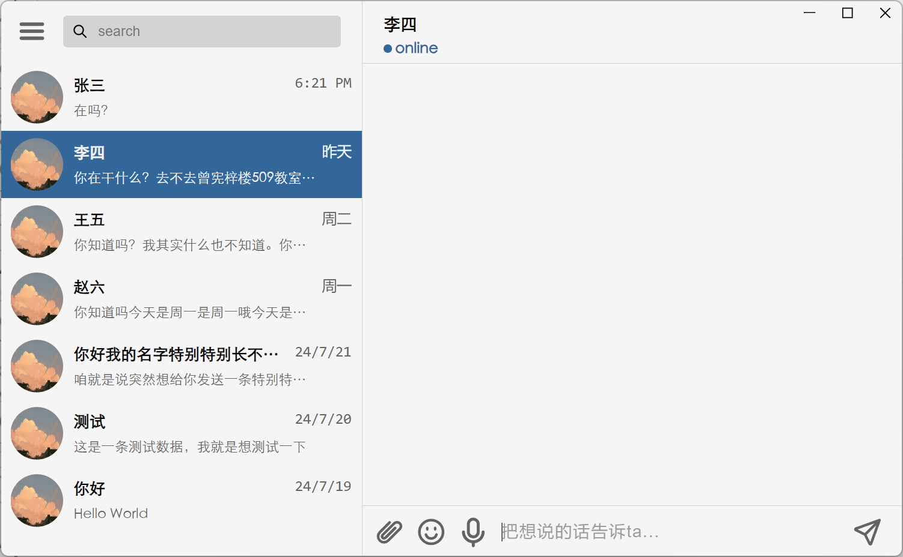

## day 26

- 后续内容技术栈确定。后端使用 node.js+express 框架，数据库使用 MongoDB，使用 websocket 实现即时通信
- 完善右侧聊天界面样式

  - 新建 ChatMsg 组件，用于显示单条聊天记录
  - 实现了文本超过 50%行宽自动换行
  - 使用 border 的特性绘制了对话框底部的三角形箭头
  - 添加了录制音频的动画

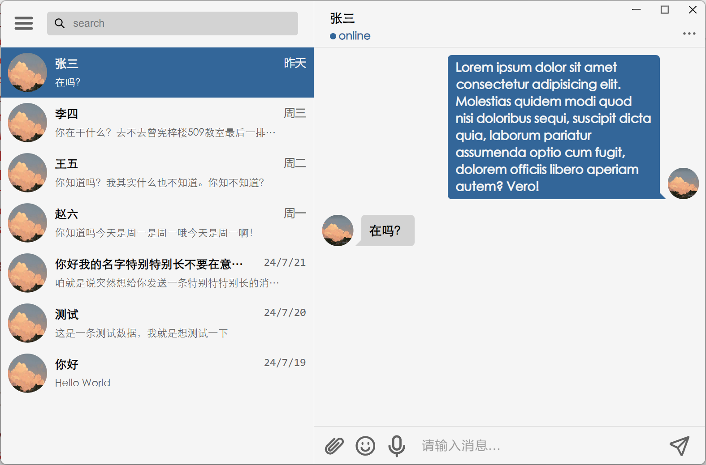

## day 28

- 搭建了项目中后端的基本框架
- 创建了 config 文件用于存放静态配置参数，如端口号、数据库名、当前 ip 和协议等

## day 29

- 新增了用户注册接口
- 使用 jwt 解决身份验证问题，新建了 jwt 校验中间件。使用 if 判断排除了不需要通过校验的路径和方法
- 使用 MongoDB 搭建了数据库
  - 新增了四种文档模型
    - User：存储用户信息
    - Group：存储群聊组信息
    - Message：存储聊天记录信息
    - Friendship：存储好友关系信息

## day 30

- 后端

  - 新增了全局异常处理中间件
  - 使用 express-validator 对请求参数进行校验，封装了参数校验 util 函数
  - UserRouter 新增了用户登录、获取用户好友列表接口
  - MessageRouter 新增新建消息、获取好友间的聊天记录接口
  - FriendshipRouter 新增添加好友申请、更新好友申请接口
  - 新增了图片路径修正 util 函数，用于将保存在用户模型中的 avatar 属性的路径补充完整

- 前端

  - 登录、获取聊天记录、获取好友列表等 Mock 数据改为真实数据动态获取
  - 解决了在前端图片因 Content Security Policy 策略而无法显示的问题

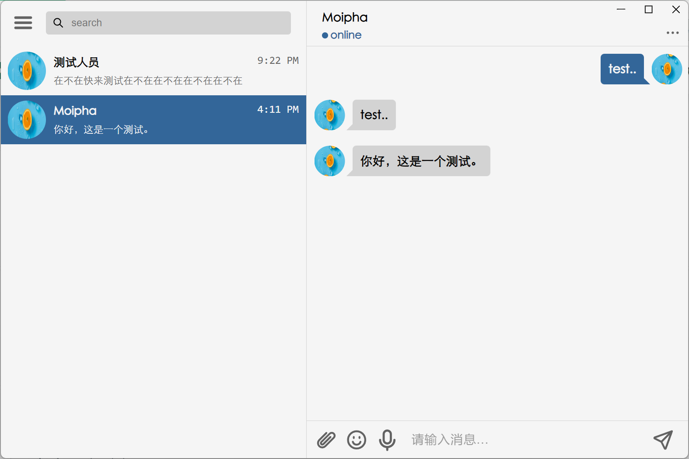

## day 31

- 使用 socket.io 库建立了 socket 连接，用于聊天的实时通信
  - 实现了聊天消息的实时发送，服务端接收到前端发送的消息后，保存该消息并将消息推送给当前用户和目标用户的客户端
- 新增了 services，将 router 中涉及数据库的操作都抽离出来放置在了 service 中
- 实现了载入 chat 组件或发送消息后就将消息区的滚动条滚动至最下方
  - 实现起来稍显麻烦。在 vue 中，本可以直接通过 ref 获取节点，然后令其 scrollTop = scrollHeight 即可让滚动条移动至低端，但由于该滚动条的容器这个节点中包含了需要发送请求动态获取的数据，所以使用常规的 onMounted + nextTick 不会生效，只能通过 setTimeout 来实现，但会有明显卡顿感，用户体验不佳
  - 我采用了通过 watch 监听页面中的 messages 变量变化时进行滚动条 scroll 属性的设置，此时页面中的变量已成功获取，滚动条属性的设置也可以正常生效

# 2024/8

## day 1

- 把 socket 连接移动到了 layout 组件中
- 解决了头像显示的小错误
- 现在输入框可以进行换行了
  - 将 input 替换成了 textarea。为实现换行后自动调整高度，对 newMsg 值进行了监听，变动时将 textarea 的 height 值设置成 scrollHeight 值高度即可自动撑开容器。
  - 遇到的问题是不管怎么修改 lineHeight，文本只有一行时却总是占据两行的高度，两行三行时高度都是正常的。最后发现 textarea 默认高度是 line-height 的两倍，即 rows 属性为 2。设置成 1 就没问题了
  - 换行后的消息显示上，换行符都变成了空格。后通过添加属性 white-space: pre-wrap;解决了这个问题
  - 也遇到了一大串字母没有自动换行的情况。设置 overflow-wrap: anywhere;后被视为一整个单词的文本也可以自动换行了
- 实现了客户端登录后修改用户状态为 online，并通知在线的好友。断线时同样会修改状态和通知
- 消息记录中现在会显示时间。每天的首条消息以及之后每隔一小时以上的消息上方都会显示对应的时间

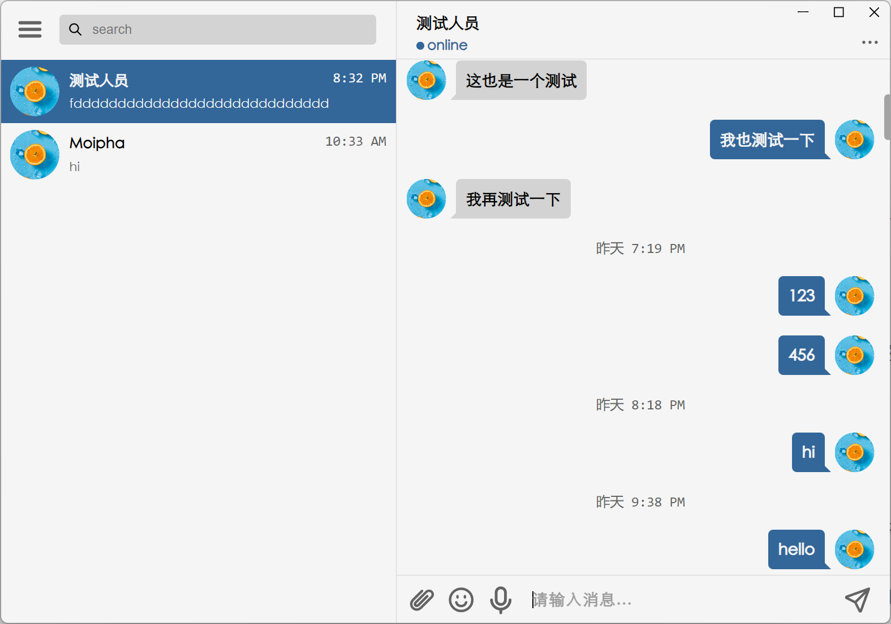

## day 2

- 修复了输入框按回车发送时高度跳动
  - 原因是 enter 默认事件会进行换行，解决方法是将 keyup 换成 keydown，然后进行判断，如果 enter 的 keydown 事件中未按下 shift，则阻止默认事件
- 修复了左侧列表的最后一条消息未与右侧聊天栏同步的情况。通过 bus 进行同步
- 编写了左侧弹出栏的样式

## day 3

- 完善左弹出栏样式

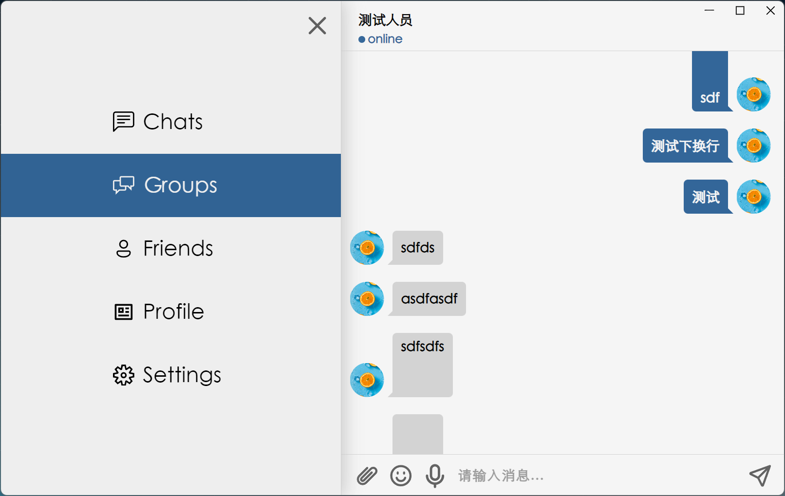

- 实现对数据进行分页获取的接口。通过传入的 pageSize 和 pageNum 来计算 limit 和 skip 从而获取对应数据

## day 4

- 前端实现上划获取分页数据的功能
  - 编写了节流函数对上划进行了限制
  - 通过保存附加数据前第一个子元素的高度位置，然后在获取新的分页数据后调整滚动条的位置至保存的高度，以实现附加数据后内容不会跳动
  - 通过 pinia 和持久化存储来保存已获取的聊天记录

## day 7

- 修复了由于切换聊天用户，socket 监听事件堆叠导致的问题
  - 在 activated 和 deactivated 生命周期中进行事件的绑定和解绑
- 重新设定了页码，在获取聊天记录同时获取总页数，然后在此基础上获取指定页码的分页记录
  - 从旧记录为大页码改为新记录大页码，防止添加新的消息时前面的消息页码变动

## day 8

- 采用了游标分页的方式来取代传统页码分页查询，这样既提高了查询效率又可以防止新增消息使页码错乱的情况发生

## day 9

- 完善向上滚动获取更多消息的显示效果
  - 使用 scrollHeight 和 scrollTop 来计算底部到当前位置的高度 H，然后在获取完新的数据后将 scrollTop 设置为当前 scrollHeight 减去 H 即可
- 实现了消息缓存效果

## day 10

- 完善了左弹出栏的样式
- 将用户当前状态显示的部分抽离成了一个组件

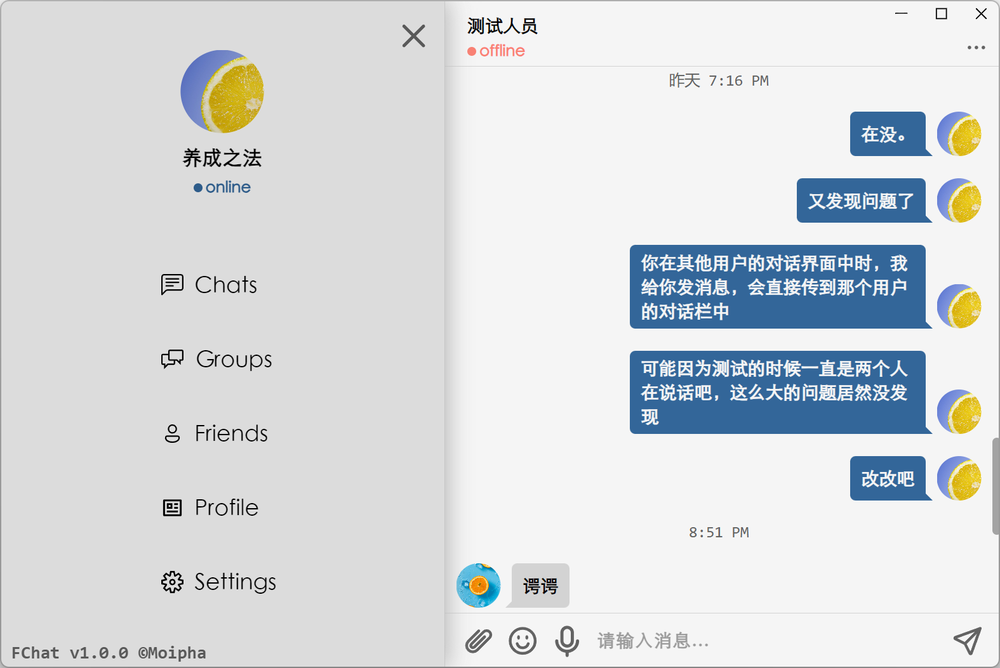

## day 11

- 修复了不同 chat 间接收消息时的混淆现象
- 将 chatlist 从 aside 组件中分离

## day 13

- 新增了右边栏，用于显示好友的详细信息并提供对好友的操作
  - 实现了点击右边栏以外的区域收回边栏，通过 contain 方法来判断点击事件对象的目标是否包含在目标节点之内。点击 header 组件中的按钮打开边栏，并同时给全局绑定上述点击事件。触发事件后解绑

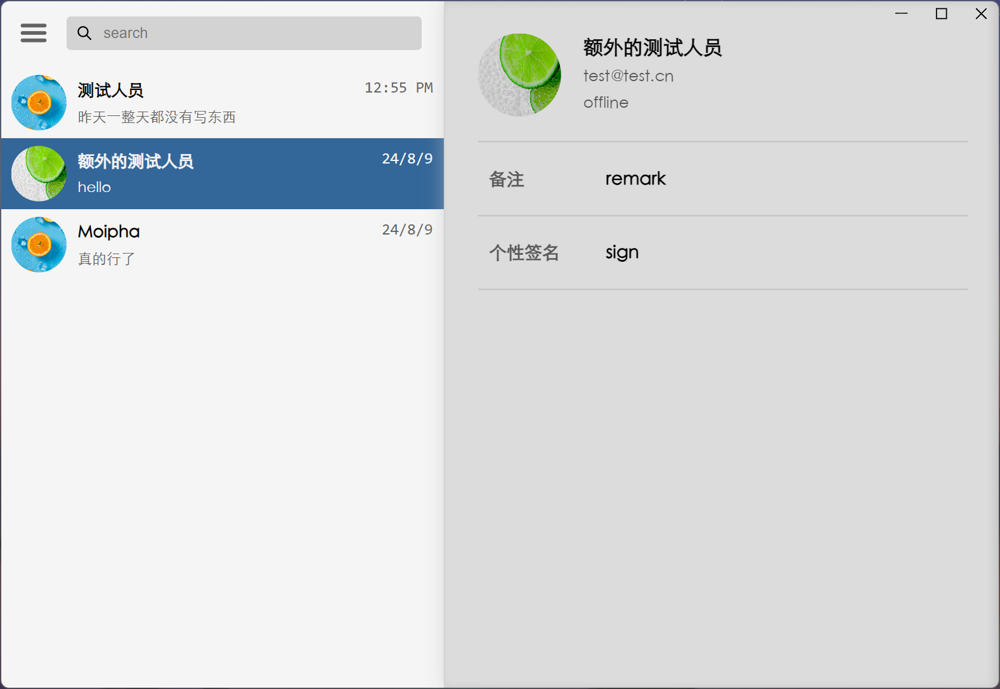

## day 15

- 完善了右边栏样式

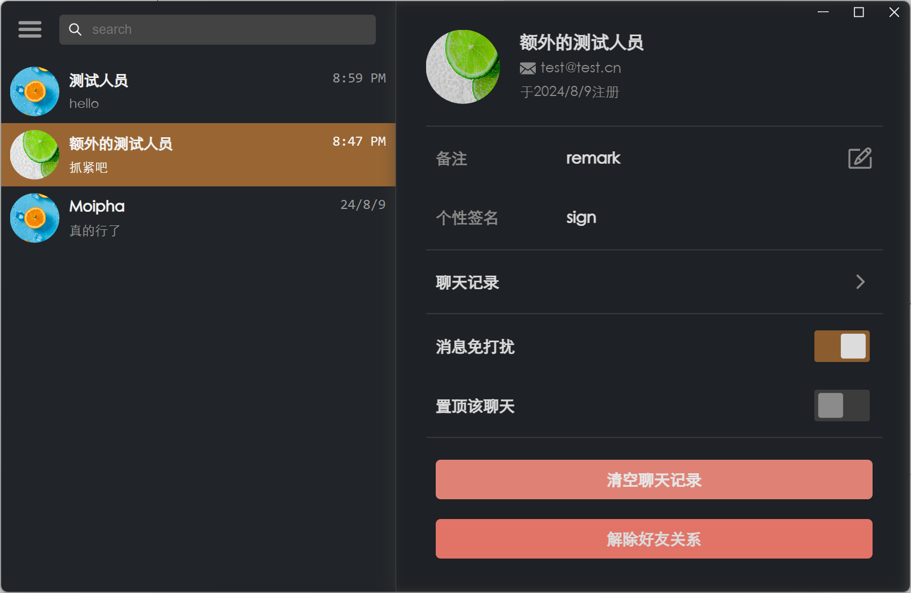

## day 16

- 添加 Emoji 组件，显示表情栏
- 实现表情栏窗口的弹出和关闭
  - 期间遇到 ipcMain 的事件重复绑定的问题，通过在关闭窗口中解绑对应事件解决

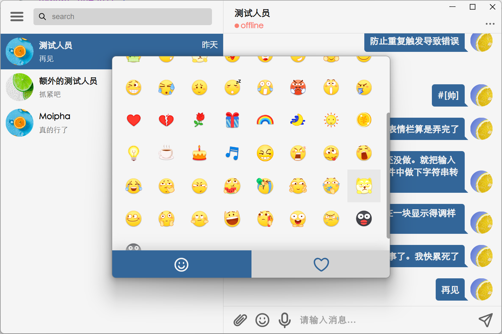

## day 17

- 实现表情在输入框中的显示

  - 重构了输入框
    - 现在输入框基于可编辑的 div 元素实现
    - 将输入框分离出 Chat 组件，新建了 InputArea 组件
  - 实现了表情栏和输入栏的跨窗口通信
    - 现在点击表情栏中的表情可以在输入框中显示对应图片，然后实际消息增加表情对应的标识符（字符串类型，#[]格式）
  - 遇到的问题
    1. 起始使用 v-html 来显示输入框中的内容，在 input 事件中替换 newMsg 的值为事件对象的 innerText，后发现每次输入指针都会自动跑到最前面，而且 v-html 存在 xss 攻击的隐患
    2. 关于 newMsg 和 html，本打算一个变量存储实际 html，一个来存储对应的实际消息，但难以实现它们复杂的转换，改为：点击表情获取 id，在输入框中添加对应 src 和 alt 的 img 元素
    3. 关于拖拽和复制粘贴，对这些操作进行了一定程度的限制
    4. 将输入栏组件分离后的诸多问题：
       1. friend 对象无法正常获取：原因是 friend 对象在 chat 组件中是异步获取的，所以在模板中把 friend 对象作为自定义参数传入 InputArea 组件是无法正常生效的，只能通过 v-if 限制 InputArea 组件的渲染，等 friend 获取之后再加载对应的输入框组件
       2. 在新组件中没有 onActivated 周期，所以 ipcMain 的表情获取的回调函数未能正确的传递
    5. 表情插入后输入框失焦以及浮标错位，通过 selection、range 等未接触过的类实现了在当前浮标处插入表情图片和重新聚焦等来解决。在文本之间插入表情也是通过这些来实现的
    6. 换行和空格被变成了 br 元素和$nbsp;通过正则和 replace 进行替换以解决

- 实现表情在消息栏中的显示

  - 现在消息栏中可以正常显示表情
    - 具体方法是通过识别#[]格式的字符串，然后替换为对应的 img 标签，再通过 v-html 来渲染
    - 后续改进：通过函数来识别#[]字符串并将原字符串拆分成文本和表情字符串集合的数组，然后通过 v-for 按顺序渲染这些文本和表情
    - 将 msg-box 由 flex 布局改为了普通的布局，因为渲染文本和图片在 flex 布局中会错位

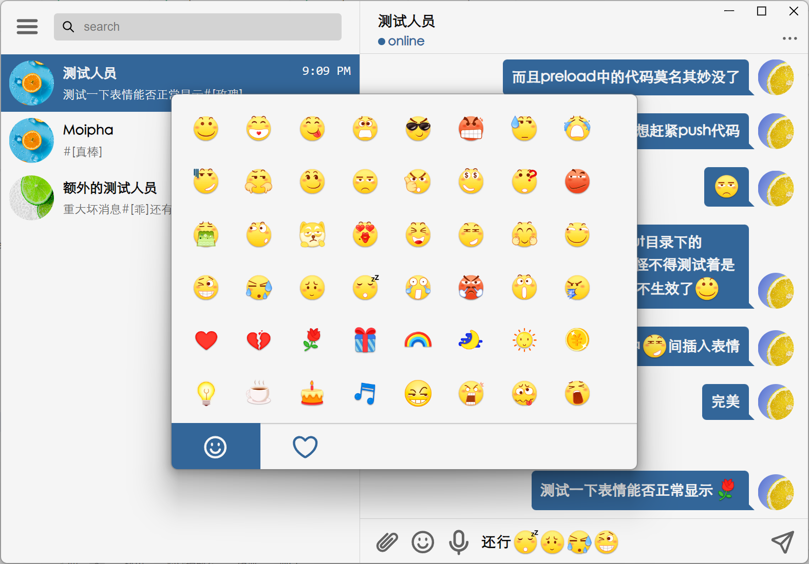

## day 18

- 添加了新的字体：SmileySans，国内开源免费的优质字体
- 后端新建了新的文档模型（已读回执），以及基本的查询和 save 方法
  - 打算通过建立已读回执的方式来进行已读未读的判断

## day 19

- 完成了消息界面已读未读的功能

> 我在博客上记录了这部分开发的详细思路：[FChat 开发记录 - 消息已读管理-CSDN 博客](https://blog.csdn.net/fafafafa_fa/article/details/141334394)

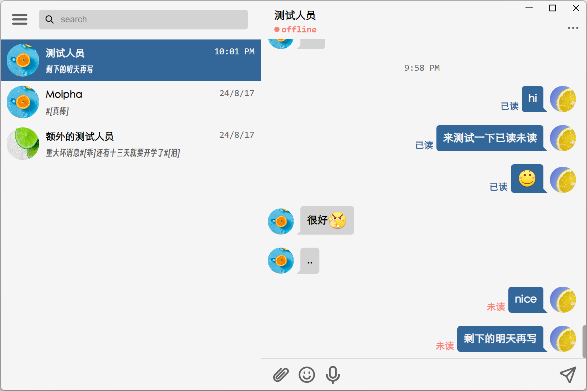

## day 22

- 完善了 README 文档

## day 23

- 完成邮箱验证和注册功能
  - 通过 nodemailer 发送邮件，邮箱服务器使用的是 qq 邮箱
  - 使用 crypto 来生成随机验证码
  - 使用 memory-cache 来缓存对应的邮箱和验证码

## day 27

- 完成 nav 栏的切换功能
  - 使用一个对象来存储路由映射关系
  - 跳转路由时发现无法正常获取 ChatList 组件中的 avtiveItem，原因是在 setup 阶段获取到的 route 信息是错误的。通过设置 setTimeout(()=>{}, 0)的方式解决
  - 跳转后记录当前路由，等再回到这个 nav 时会自动恢复路由
- 简单编写了好友列表界面

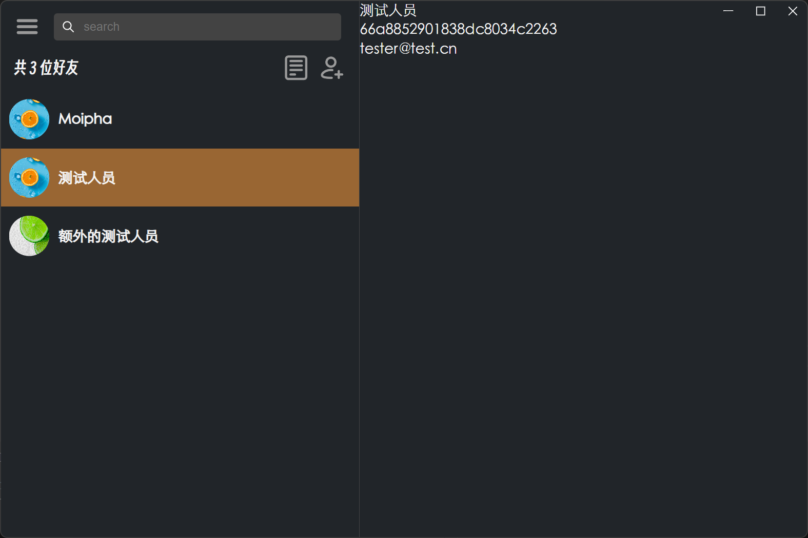

- 从引入新字体之后控制台一直报错：

`[Intervention] Slow network is detected. See https://www.chromestatus.com/feature/5636954674692096 for more details. Fallback font will be used while loading: http://localhost:5173/@fs/C:/Users/Young/Desktop/chat/front-end/public/fonts/SmileySans-Oblique.otf.woff2`

- 通过在 html 中加入字体预加载解决了该问题

```html
<link
  rel="preload"
  href="/path/to/your/font.woff2"
  as="font"
  type="font/woff2"
  crossorigin="anonymous" />
```

## day 28

- 编写了申请列表的样式
- 后端编写了查询好友列表和查询申请消息等接口
- 添加了接收到消息后的提示音

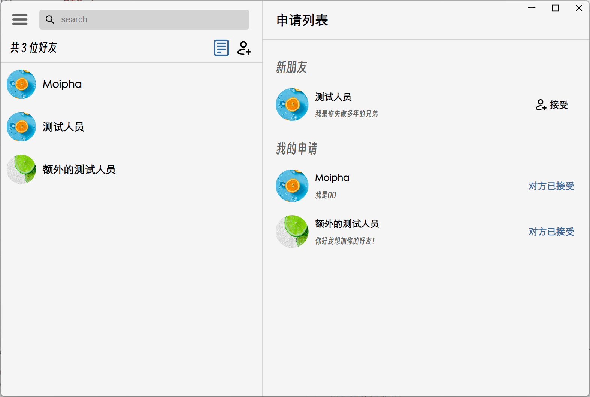

## day 29

- 修复打包后黑屏的问题
- 后端添加 cors 解决跨域问题，不再使用前端 proxy 代理解决
- 解决了 electron-builder 打包后前端静态资源无法获取的问题

## day 31

- 后端新增统一返回类 Result，统一了返回的格式，并提供了 success 和 error 两个便捷的方法来调用
- 重写了 electron 的主进程代码，将冗余的代码进行了合并和清除
- 修复了前端时间格式化工具的错误（是否是本周的判断中出现了错误）
- 简单编写了添加好友的界面

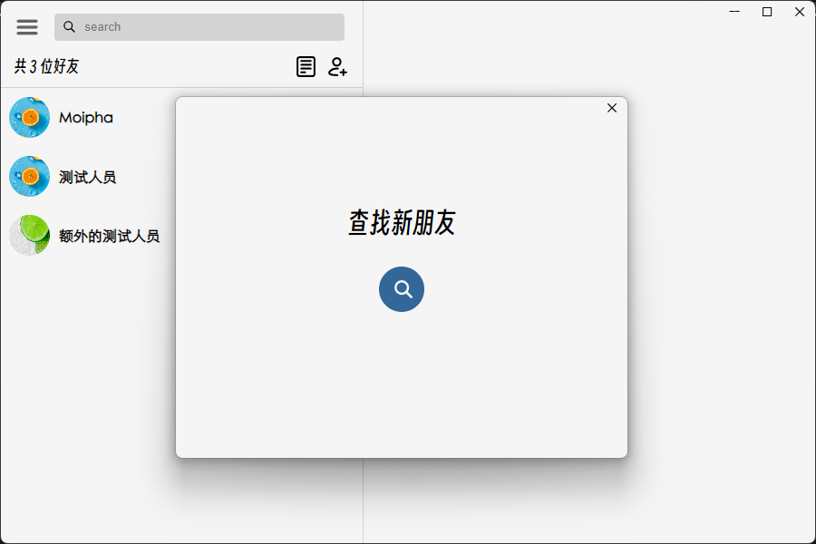

# 2024/9

## day 1

- 后端编写了根据关键词模糊查询用户的接口
- 继续编写添加好友的界面，添加了一些动画效果

## day 2

- 完善查找界面样式
- 完善了搜索框组件的内容
- 对输入框搜索的函数进行了防抖处理
- 解决了 chat 组件中切换对话后 bus 事件无法触发的问题
  - 原因是未在 reactive 生命周期中重新绑定事件

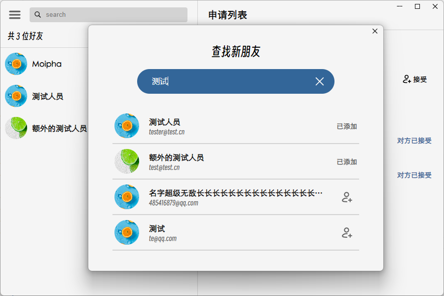

## day 4

- 重写了主进程代码
  - 重写了关于表情 id 的 ipc 事件的绑定，现在不需要重复地绑定与解绑
  - 增加了新建窗口的配置项，现在可以创建在任务栏中显示的窗口
  - 实现窗口自定义标题名
- 优化了有关标题栏的代码
  - 取消所有默认标题栏，改为自定义标题栏
  - 将 Titlebar 组件进行完善，通过传入参数控制显示哪些按钮以及调整一些样式

## day 6

- 编写了申请好友界面的样式
- 修复了输入框中频繁出现红色波浪线提示的问题
  - 在 input 元素中添加 `spellcheck="false"`即可
- 修复了多处文本溢出的错误
- 完善了添加好友的接口
- 实现了申请列表中接受请求的功能

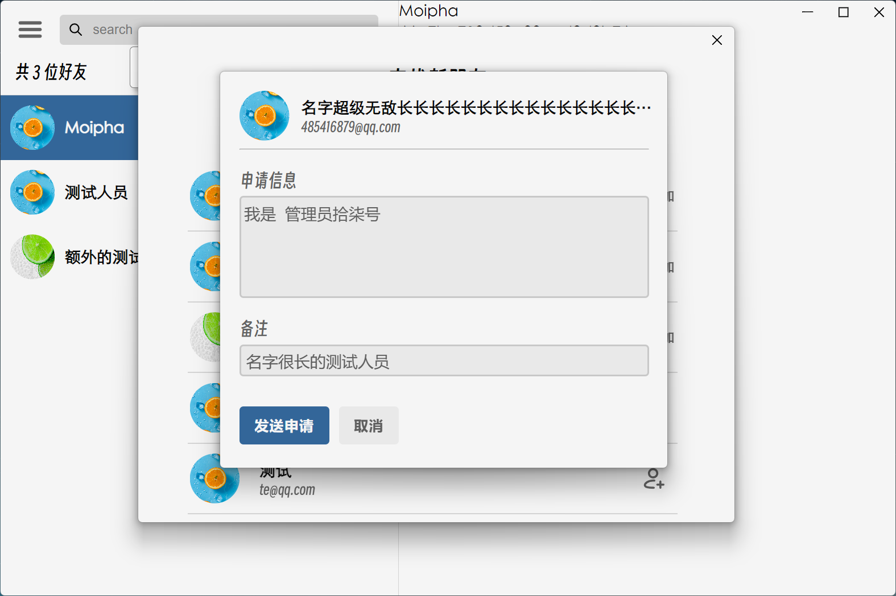

## day 8

- 编写了朋友详细界面的样式
- 在 Nav 组件中新增了便捷的跳转方法

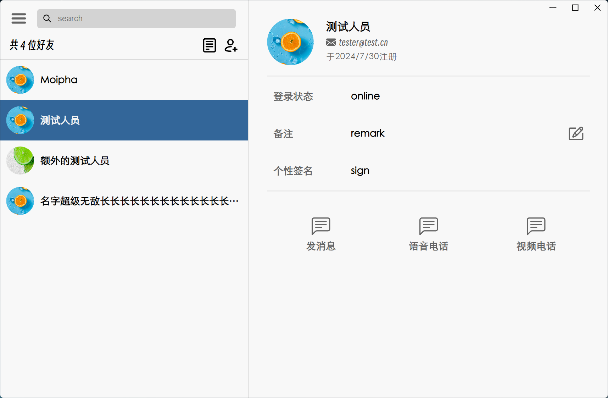

## day 9

- 实现了本地音频录制的功能
- 仿照 telegram 重写了 nav 栏的样式
  - 使用 Teleport 和 Transition 标签实现了遮罩层的显示

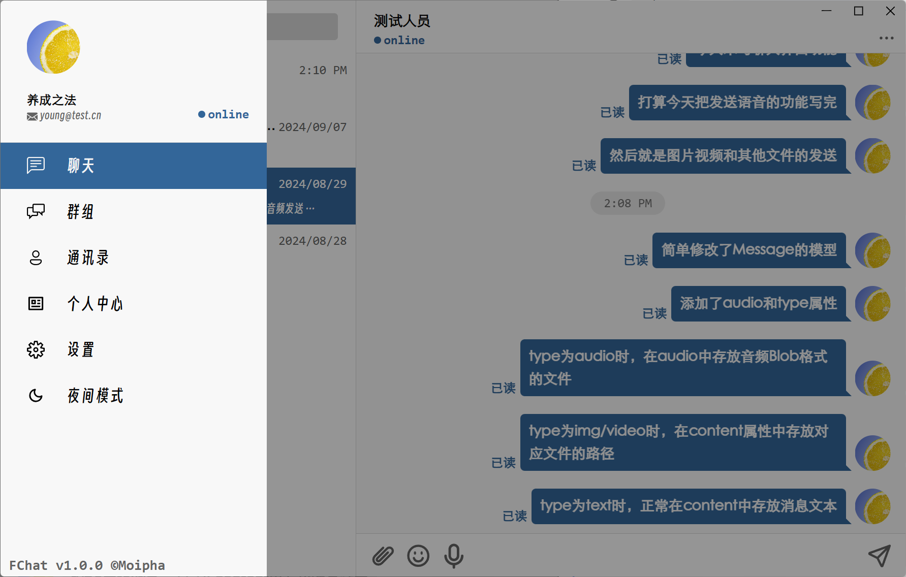

## day 10

- 完善了 nav 栏的样式，添加了 switch 按钮并实现了切换主题的功能
- 实现了音频在本地的录制与上传服务器的功能
- 编写了音频消息在聊天界面中的显示样式
- 自定义了播放控件样式与功能

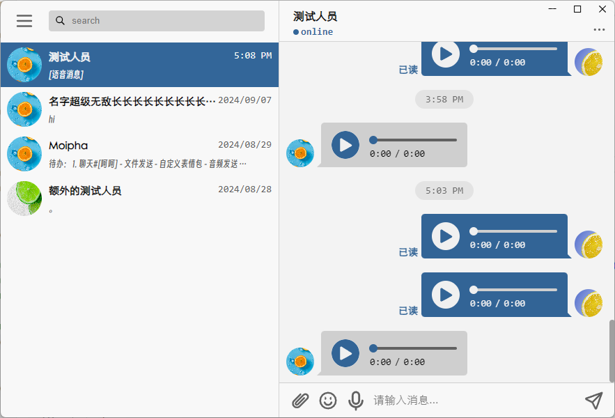

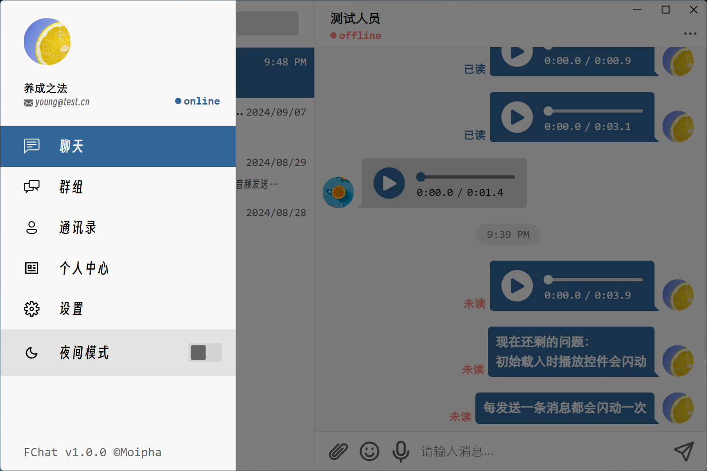

## day 11

- 通过在音频消息 `loadedmetadata`事件上添加 `.once`修饰符修复了发送新消息后音频消息闪动的问题、
- 将使用 Teleport 编写的边栏遮罩抽象为组件 Mask。重写了右边栏（好友详细信息）的样式
- 在聊天界面的上方显示好友最后查看消息的时间。使用了一套新的时间格式化函数来进行时间的显示
- 修复了 socket 中 read 事件发送给错误用户的问题。现在事件名与目标用户 id 相关

## day 13

- 完善了右边栏的样式
- 修改了聊天界面的字体相关样式
- 优化了各个列表中 item 的悬浮效果
- 解决了切换主题时部分文本和背景颜色切换延迟问题


## day 15

- 重写了夜间模式的主题色
- 完成了后端 node 程序以及 MongoDB 服务在服务器上的部署
- 实现了前端和后端的环境变量设定

  - 前端使用 electron-vite 自带的 env 文件编写配置文件，通过在 npm 指令中添加 --mode 参数来加载不同的配置文件
  - 后端使用 cross-env 实现在 npm 指令中传入环境参数，使用 dotenv 根据环境参数动态引入对应的 env 文件

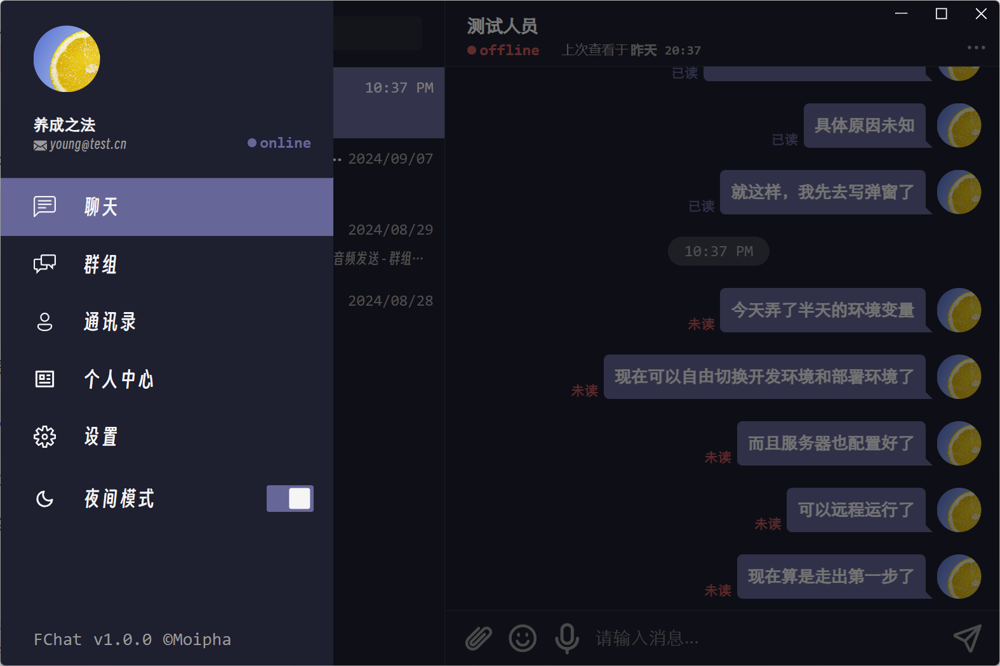

## day 16

- 编写了全局弹窗插件，现在可以通过$notify 方法来调用提示弹窗
  - 使用防抖函数实现了多次生成弹窗后在最后一次调用的 duration 后消失

## day 17

- 重写了登录界面

  - 左侧

    - 动态三色融合背景
    - 键入效果说明文本
    - 引入图标
    - 外部链接跳转

  - 右侧

    - 自适应布局表单
    - 编写 Input 和 Btn 自定义组件
    - 写了一下午的样式

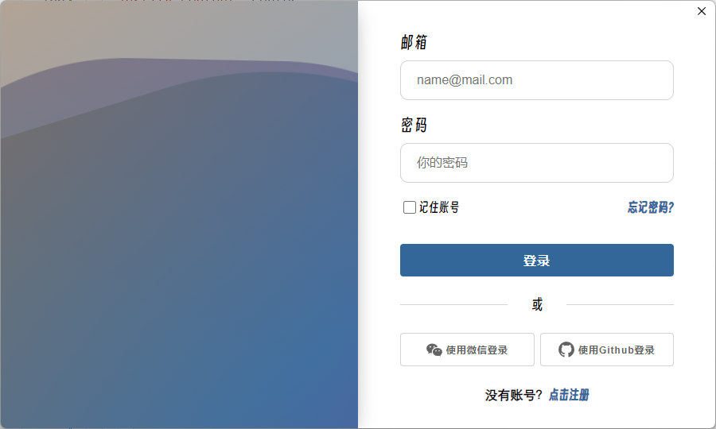

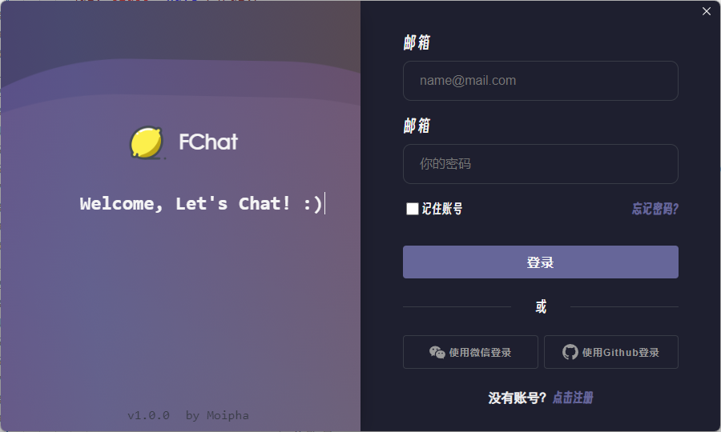

## day 18

- 完成了注册界面样式编写
- 重写了接收验证码和设置密码的窗口

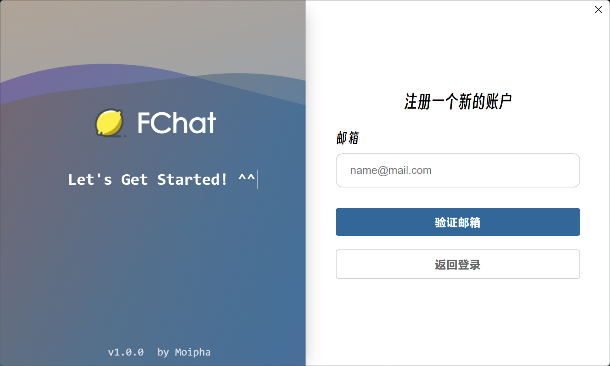

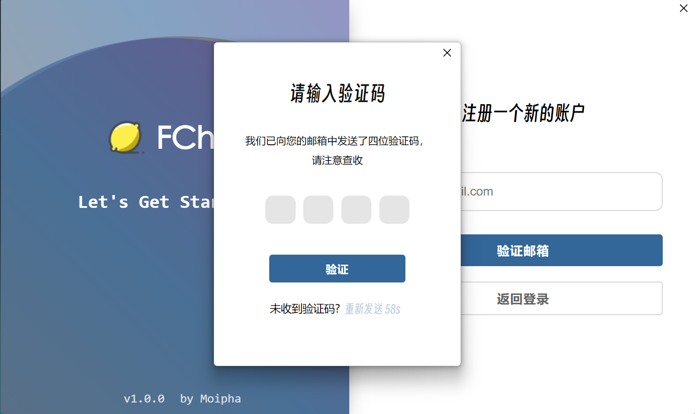

## day 20

- 实现了 github 的 oAuth 授权登录
  - 现在可以通过 github 账号登录 fchat，若首次登录会自动创建账号

## day 21

- 在主进程中添加一个 map 来解决多次打开同一个子窗口的问题
- 前端新安装了 vue-draggable-plus 来实现对话列表的可拖拽
- 将所有用户初始数据获取的操作都放置在了登录成功的回调中
- 添加了个人资料页面，实现了基本资料的更新

# 2024/12

## day 22

- 修改了右边栏和输入框的字体

## day 24

- 实现了前端的文件上传功能
- 编写了 dialog 组件

## day 25

- 实现了拖拽上传文件
- 后端编写了文件模型

## day 26

- 后端编写了存储文件的接口
- 前端编写了显示文件消息的样式

## day 27

- 实现了发送文件的功能
  - 包括后端下载上传文件接口
  - 前端拖拽上传、显示文件消息、点击下载、本地缓存等

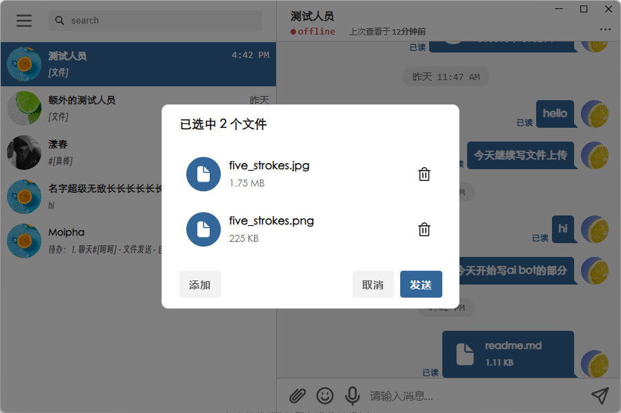

## day 28

- 添加了 AI 聊天面板

## day 29

- 搭建了 AI 聊天界面侧边栏、聊天框区域的样式
- 编写了根据聊天记录日期进行分组排序的函数，将侧边栏记录分组

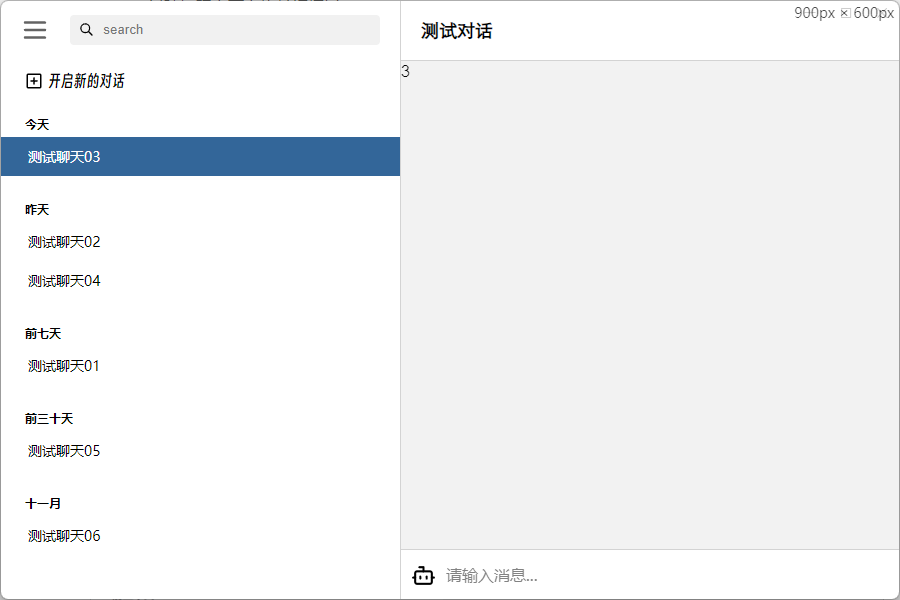

## day 30

- 数据库新增 ai 对话模型用于存储每个用户开启的不同对话，使用之前创建的 Message 模型来存储与 ai 对话的消息
- 后端新增接口
  - 开启新的 ai 对话
  - 根据对话 id 获取分页消息列表

# 2025/1

## day 1

- 编写聊天内容区的界面样式

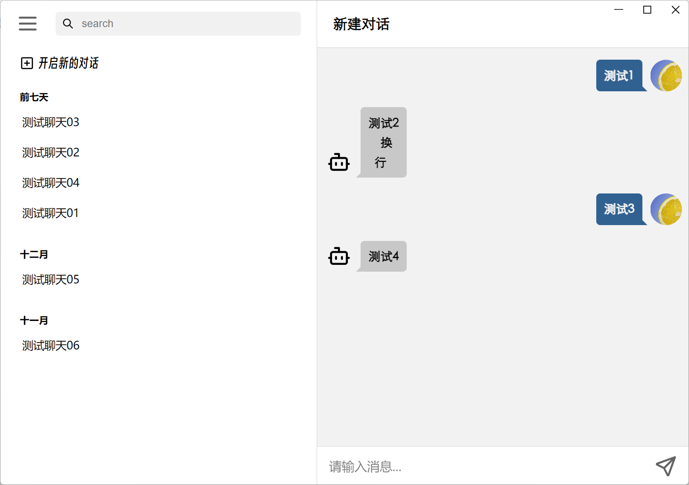

## day 2

- 根据讯飞开放平台提供的 WebSocket 调用文档实现了大模型的接入

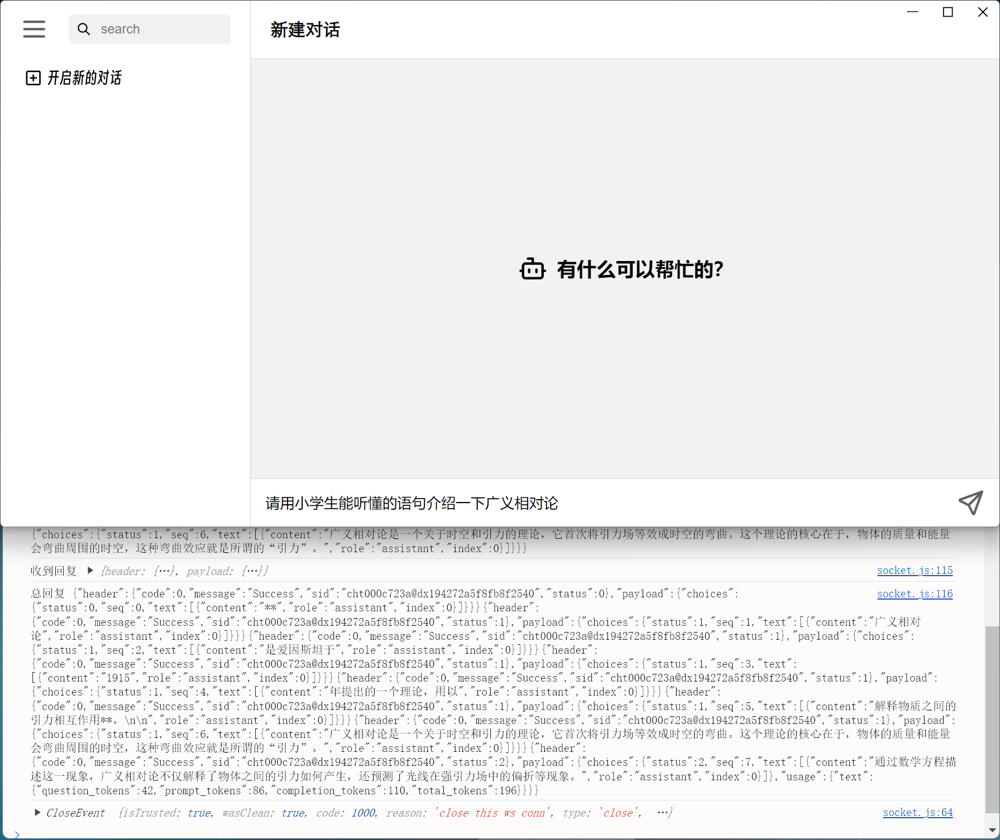

## day 3

- 实现了 ai 聊天以及在界面正常显示聊天记录
- 在新对话中，结束第一次问答后会创建新的对话，存储聊天记录，并通过 emitter 通知左边栏更新对话列表，然后跳转到该对话的界面。
- 在创建新对话的同时会使用大模型生成本次对话的标题，然后调用接口更新对话标题

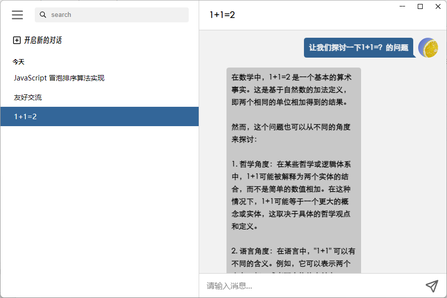

## day 4

- 前端添加 ai 界面左边栏列表项菜单栏
- 后端添加修改对话信息和删除对话并删除对话聊天信息的接口
- 实现了编辑标题功能
  - 点击重命名，在标题位置显示输入框，输入框会自动聚焦
  - 输入框失焦会自动取消编辑
  - 回车发送请求更新对话标题

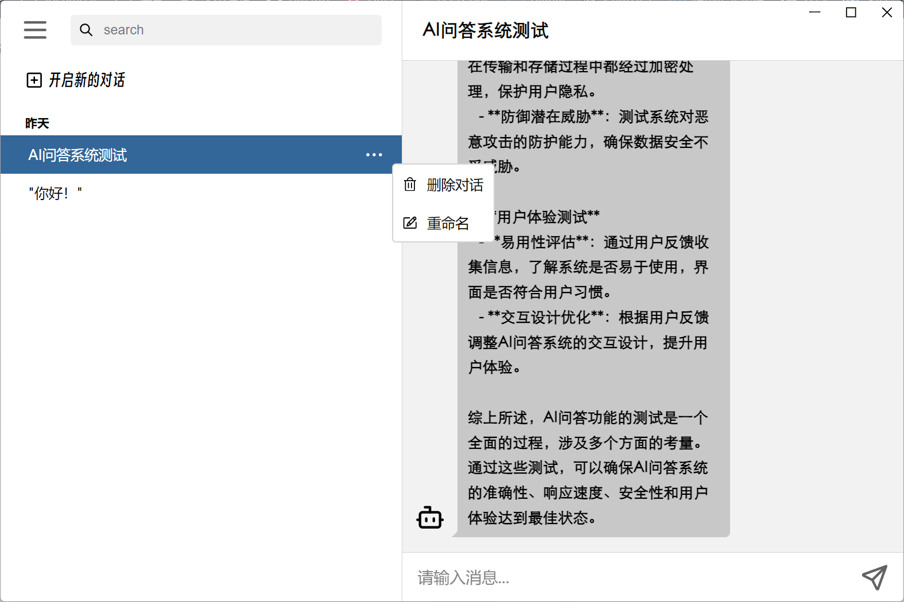

## day 5

- 添加删除对话前的确认窗口
- 修复了对话列表项过多时，在底部点击菜单显示不全的问题
  - 点击菜单按钮后会根据当前高度计算与底部的距离是否在弹出框高度的距离以内，是的话则会显示不全，改为显示在上面
